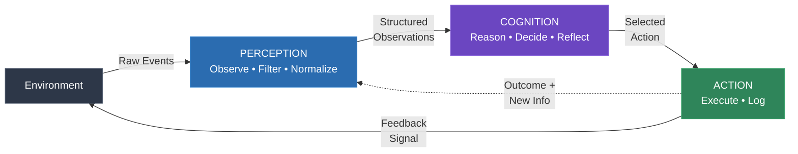
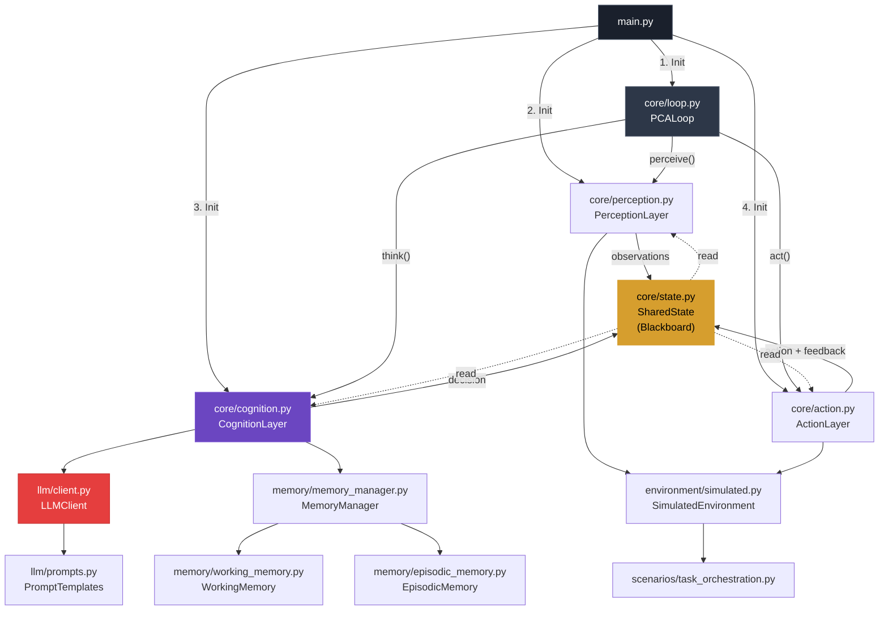
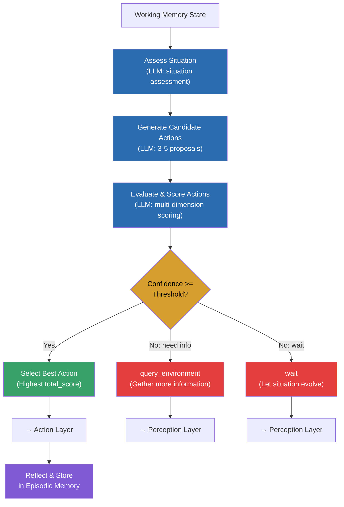
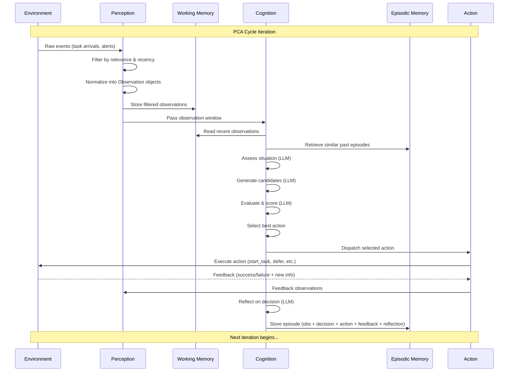

# Autonomous Decision-Making Agent

A production-quality Python implementation of the **Perception → Cognition → Action (PCA)** loop — the foundational architectural pattern for autonomous AI agents, based on **Section 5.1 (pp. 118–132)** of *"30 Agents Every AI Engineer Must Build"* (Packt Publishing).

---

## Overview

This agent operates as a **continuous, real-time loop** that perceives its environment, reasons about what to do, takes action, and learns from the results. It is designed around three core principles:

1. **Autonomy** — The agent makes decisions independently using LLM-powered reasoning, without requiring human intervention for each action.
2. **Adaptability** — Through episodic memory and self-reflection, the agent learns from past decisions and improves over time.
3. **Transparency** — Every decision includes a full reasoning trace, confidence score, and reflection, enabling auditability and debugging.

The agent connects to a **local LM Studio** instance for LLM inference, supporting **Qwen 3.5** and **Gemma 4** models. A simulated "Task Orchestration" environment is included for testing and demonstration.

---

## Architecture Deep-Dive

### A. High-Level PCA Loop Diagram

The agent operates in a continuous cycle: the environment provides observations, the Perception layer filters and normalizes them, the Cognition layer reasons and decides, the Action layer executes, and feedback flows back to close the loop.



**How it works:**

- **Environment → Perception**: Raw events (task arrivals, deadline warnings, system alerts) flow into the Perception layer.
- **Perception → Cognition**: Filtered, normalized observations are passed to the Cognition layer for reasoning.
- **Cognition → Action**: The Cognition layer selects the best action after evaluating candidates, and the Action layer executes it.
- **Action → Environment**: Actions modify the environment (starting tasks, deferring, escalating).
- **Feedback Loop**: The environment's response (success/failure/partial) feeds back into Perception as new observations, closing the loop.

### B. Detailed Component Architecture

This diagram shows how `main.py` initializes the system and how the core components relate to each other and to supporting subsystems.



**Key architectural decisions:**

- **SharedState (Blackboard Pattern)**: All three layers communicate through a shared blackboard rather than direct method calls. This decouples the layers and makes the system easier to extend — new layers can read/write to the blackboard without modifying existing code.
- **LLM Client Abstraction**: The Cognition layer never directly calls the OpenAI API — it goes through the `LLMClient` wrapper, which handles retries, timeouts, and token tracking. This makes it trivial to swap LLM providers.
- **Memory Manager Facade**: The `MemoryManager` provides a unified interface over working and episodic memory, simplifying the Cognition layer's interactions.

### C. Cognition Internal Flow (Decision Engine)

This is the most complex component — the decision engine that powers the agent's autonomy.



**Decision pipeline explained:**

1. **Assess Situation**: The LLM synthesizes the current observations, working memory context, and recent decisions into a structured assessment. This includes identifying urgent items, patterns, and risks.

2. **Generate Candidate Actions**: Based on the situation, the LLM proposes 3-5 candidate actions, each with a name, description, action type, parameters, and rationale.

3. **Evaluate & Score**: Each candidate is scored on four dimensions:
   - **Effectiveness** (weight: 0.4) — How well does this address the situation?
   - **Risk** (weight: 0.3) — How risky is this action? (inverted so lower risk = higher score)
   - **Information Gain** (weight: 0.15) — Will this action provide useful new information?
   - **Alignment** (weight: 0.15) — Does this align with the agent's goals and constraints?

4. **Confidence Check**: If the LLM's overall confidence in the evaluation is below the configured threshold (default: 0.6), the agent has three options:
   - **Gather more information** (`query_environment`) — When the agent needs more data to decide.
   - **Wait** — When the situation is expected to evolve naturally.
   - **Act anyway** — When an urgency override applies (e.g., critical deadline).

5. **Select Best Action**: The highest-scoring action is selected and dispatched to the Action layer.

6. **Reflect**: After the action is executed and feedback is received, the LLM reflects on the decision — was it good? What could have been done differently? This reflection is stored in episodic memory for future reference.

### D. Memory & State Lifecycle

This sequence diagram shows how data flows through the system over time, from raw environmental events to stored episodic memories.



**Data lifecycle:**

1. **Raw events** from the environment are ingested by Perception and converted into structured `Observation` objects.
2. **Observations** are stored in **Working Memory** (short-term, rolling buffer with configurable capacity).
3. **Cognition** reads from Working Memory and **Episodic Memory** (long-term, persisted to JSONL) to form a complete picture.
4. After each decision cycle, the complete episode (observation, decision, action, feedback, reflection) is **stored in Episodic Memory** for future retrieval and learning.
5. **Feedback** from actions flows back into Perception as new observations, closing the loop.

---

## Getting Started

### Prerequisites

- **Python 3.10+** (required for modern type hints and `match` statements)
- **LM Studio** — Download from [lmstudio.ai](https://lmstudio.ai/)
- **A model downloaded in LM Studio** — Recommended: Qwen 3.5 or Gemma 4

### Installation with uv

This project uses **uv** as the package manager for fast, reliable dependency resolution.

```bash
# 1. Clone the repository
git clone <repository-url>
cd autonomous_agent

# 2. Create a virtual environment and install dependencies
uv venv
source .venv/bin/activate  # On Windows: .venv\Scripts\activate

# 3. Install dependencies
uv pip install -r requirements.txt

# Or install as an editable package:
uv pip install -e .
```

### LM Studio Setup

1. **Open LM Studio** and navigate to the search/download tab.
2. **Download a model** — search for "Qwen 3.5" or "Gemma 4" and download your preferred variant.
3. **Load the model** — go to the chat tab, select your downloaded model, and wait for it to load.
4. **Start the local server** — click the "Start Server" button (or use the Developer tab). The default endpoint is `http://localhost:1234/v1`.
5. **Verify the server** — open a browser and navigate to `http://localhost:1234/v1/models` to confirm your model is listed.

### Configuration

Edit `config.yaml` to customize the agent:

```yaml
llm:
  base_url: "http://localhost:1234/v1"   # LM Studio endpoint
  api_key: ""                             # Empty for local inference
  model: "qwen3.5"                        # Model identifier in LM Studio
  temperature: 0.7                        # Creativity vs. determinism (0.0–2.0)
  max_tokens: 2048                        # Max response length
  top_p: 0.9                              # Nucleus sampling threshold
```

**Model swapping:** To use Gemma 4 instead of Qwen 3.5, simply change the `model` field to match the model identifier shown in LM Studio's server tab. For example:

```yaml
llm:
  model: "gemma4"
```

---

## Usage

### Basic Run

```bash
python main.py
```

### CLI Arguments

| Argument | Description |
|---|---|
| `--config <path>` | Path to a custom configuration YAML file (default: `config.yaml`) |
| `--dry-run` | Run the cognition layer but **do not execute** actions. Useful for testing LLM reasoning without side effects. |
| `--verbose` | Print **full reasoning traces** from the LLM to the console. |
| `--max-iterations <N>` | Override the `max_iterations` setting from the config file. |

### Example: Dry Run with Verbose Output

```bash
python main.py --dry-run --verbose --max-iterations 10
```

### Example Console Output

When you run the agent, you'll see a Rich-formatted console output like this:

```
╭──────────────────────────────────────────────────╮
│     AUTONOMOUS DECISION-MAKING AGENT             │
│     Perception → Cognition → Action Loop         │
│                                                   │
│     Based on "30 Agents Every AI Engineer Must    │
│     Build" (Section 5.1, pp. 118–132)            │
╰──────────────────────────────────────────────────╯

┌──────────────────────────────────────────────────┐
│  Configuration                                    │
├─────────────────────┬────────────────────────────┤
│  Agent Name         │ AutonomousAgent            │
│  LLM Model          │ qwen3.5                    │
│  LLM Endpoint       │ http://localhost:1234/v1   │
│  Scenario           │ task_orchestration         │
│  Max Iterations     │ 50                         │
│  Loop Interval      │ 2.0s                       │
│  Confidence Thresh. │ 0.6                        │
└─────────────────────┴────────────────────────────┘

─────────── Cycle 1/50 ───────────
  Decision: tool_use (confidence: 0.78)
  Latest observation: New task T-001: 'Deploy auth service to staging' (P5)
  Feedback: OK — Started task T-001: 'Deploy authentication service...'
  Decisions: 1 | Avg Confidence: 0.78 | LLM Calls: 4 | Tokens: 3842

─────────── Cycle 2/50 ───────────
  Decision: wait (confidence: 0.45)
  Latest observation: Task T-001 is now in progress.
  Feedback: OK — Agent chose to wait for more information.
  Decisions: 2 | Avg Confidence: 0.62 | LLM Calls: 8 | Tokens: 7621
```

---

## Simulated Environment Scenario

### Task Orchestration

The default scenario simulates a **task management system** where the agent acts as a project orchestrator. Tasks arrive over time with varying priorities, dependencies, and deadlines.

#### Event Types

| Event Type | Description | Relevance |
|---|---|---|
| `task_arrival` | A new task has been added to the queue with priority, dependencies, and deadline | High |
| `deadline_warning` | A task's deadline is approaching (within 2 hours) | Very High |
| `task_completed` | A previously started task has finished execution | High |
| `resource_alert` | A resource constraint has changed (e.g., high CPU usage) | Medium |
| `dependency_resolved` | All blocking dependencies for a task have been completed | Medium-High |
| `heartbeat` | No significant events this tick | Low |

#### Action Types

| Action Type | Description | Parameters |
|---|---|---|
| `respond` | Send a message or status update | `message` |
| `query_environment` | Request more information from the environment | `query` |
| `wait` | Do nothing; wait for new information | — |
| `escalate` | Escalate a task to a human operator | `task_id` |
| `tool_use` | Use a specific tool: `start_task`, `defer_task`, `request_info` | `tool`, `task_id` |

#### Task Constraints

- Tasks with **unmet dependencies** cannot be started.
- **Only one task** can be in progress at a time.
- **Higher priority** tasks (5 = highest) should be addressed before lower ones.
- **Approaching deadlines** increase urgency and affect relevance scoring.
- Tasks take 2–4 ticks to complete once started.

---

## Project Structure

```
autonomous_agent/
├── README.md                        # This file — comprehensive documentation
├── config.yaml                      # Agent configuration (LLM, memory, environment)
├── requirements.txt                 # Python dependencies
├── pyproject.toml                   # uv-compatible project metadata
├── main.py                          # Entry point — starts the PCA loop
│
├── core/                            # Core PCA loop components
│   ├── __init__.py
│   ├── loop.py                      # PCA loop controller (orchestration + timing)
│   ├── perception.py                # Perception layer: observe, filter, normalize
│   ├── cognition.py                 # Cognition layer: reason, decide, reflect
│   ├── action.py                    # Action layer: execute, log, feedback
│   └── state.py                     # Shared state / blackboard between layers
│
├── memory/                          # Memory subsystems
│   ├── __init__.py
│   ├── working_memory.py            # Short-term rolling buffer (deque-based)
│   ├── episodic_memory.py           # Persistent episode storage (JSONL)
│   └── memory_manager.py            # Unified interface over both memory types
│
├── llm/                             # LLM integration
│   ├── __init__.py
│   ├── client.py                    # LM Studio OpenAI-compatible client
│   └── prompts.py                   # All prompt templates for cognition layer
│
├── environment/                     # Environment interfaces
│   ├── __init__.py
│   ├── base.py                      # Abstract environment interface
│   ├── simulated.py                 # Simulated environment with scenarios
│   └── scenarios/
│       ├── __init__.py
│       └── task_orchestration.py    # Task orchestration scenario
│
├── models/                          # Data models
│   ├── __init__.py
│   ├── observation.py               # Observation dataclass
│   ├── decision.py                  # Decision dataclass (reasoning + action)
│   ├── action.py                    # Action dataclass (type, params)
│   └── feedback.py                  # Feedback dataclass (success, signal)
│
├── utils/                           # Utility modules
│   ├── __init__.py
│   ├── config_loader.py             # YAML config loader with validation
│   └── logger.py                    # Structured JSON-line logging
│
├── data/                            # Runtime data (episodic memory storage)
└── logs/                            # Agent trace logs (JSONL format)
```

---

## Extending the Agent

### Adding a New Action Type

1. **Add the action type** to the `ActionType` enum in `models/action.py`:

```python
class ActionType(str, Enum):
    RESPOND = "respond"
    QUERY_ENVIRONMENT = "query_environment"
    WAIT = "wait"
    ESCALATE = "escalate"
    TOOL_USE = "tool_use"
    CUSTOM_ACTION = "custom_action"  # ← New type
```

2. **Add a handler** in `environment/simulated.py` (or your custom environment):

```python
elif action_type == "custom_action":
    # Your custom logic here
    return {
        "success": True,
        "signal": "positive",
        "message": "Custom action executed.",
        "new_observations": ["Custom action result"],
    }
```

3. **Add a handler** in `core/action.py` if the action needs special dispatch logic beyond the environment.

4. **Update the prompt** in `llm/prompts.py` to include the new action type in the "Available Actions" section of `ACTION_GENERATION_PROMPT`.

### Adding a New Environment Scenario

1. **Create a new scenario file** in `environment/scenarios/`:

```python
# environment/scenarios/my_scenario.py
class MyScenario:
    def __init__(self, config):
        pass

    def generate_events(self, tick):
        # Return list of event dicts
        return []

    def handle_action(self, action):
        # Return result dict
        return {"success": True, "signal": "neutral", "message": "OK", "new_observations": []}

    def is_complete(self):
        return False

    def get_summary(self):
        return {}

    def reset(self):
        pass
```

2. **Register it** in `environment/simulated.py`:

```python
if scenario_name == "my_scenario":
    self.scenario = MyScenario(config)
```

3. **Update `config.yaml`**:

```yaml
environment:
  scenario: "my_scenario"
```

### Swapping the LLM Model

1. **In LM Studio**, download and load the new model.
2. **Edit `config.yaml`** — change the `model` field to match the model identifier shown in LM Studio's server tab:

```yaml
llm:
  model: "your-new-model-name"
```

3. **No code changes required** — the `LLMClient` reads the model name from config and passes it to the OpenAI-compatible API.

To use a **remote LLM provider** instead of LM Studio, change the `base_url` and `api_key`:

```yaml
llm:
  base_url: "https://api.openai.com/v1"
  api_key: "sk-..."
  model: "gpt-4"
```

---

## Configuration Reference

| Section | Key | Type | Default | Description |
|---|---|---|---|---|
| `llm` | `base_url` | string | `http://localhost:1234/v1` | OpenAI-compatible API endpoint |
| `llm` | `api_key` | string | `""` | API key (empty for local LM Studio) |
| `llm` | `model` | string | `qwen3.5` | Model identifier |
| `llm` | `temperature` | float | `0.7` | Sampling temperature (0.0–2.0) |
| `llm` | `max_tokens` | int | `2048` | Maximum response tokens |
| `llm` | `top_p` | float | `0.9` | Nucleus sampling threshold |
| `agent` | `name` | string | `AutonomousAgent` | Agent display name |
| `agent` | `loop_interval_seconds` | float | `2.0` | Seconds between PCA cycles |
| `agent` | `max_iterations` | int | `50` | Maximum loop iterations |
| `agent` | `observation_window_size` | int | `10` | Rolling observation buffer size |
| `agent` | `working_memory_size` | int | `20` | Working memory capacity |
| `agent` | `confidence_threshold` | float | `0.6` | Min confidence to act (below → gather info) |
| `memory` | `episodic_memory_file` | string | `./data/episodic_memory.json` | Path to episodic memory JSONL |
| `memory` | `max_episodic_entries` | int | `100` | Max episodes to retain |
| `environment` | `type` | string | `simulated` | Environment type |
| `environment` | `scenario` | string | `task_orchestration` | Scenario name |
| `logging` | `level` | string | `INFO` | Log level |
| `logging` | `file` | string | `./logs/agent_trace.jsonl` | JSONL log file path |
| `logging` | `log_decisions` | bool | `true` | Log full decisions |
| `logging` | `log_reasoning` | bool | `true` | Log reasoning traces |

---
